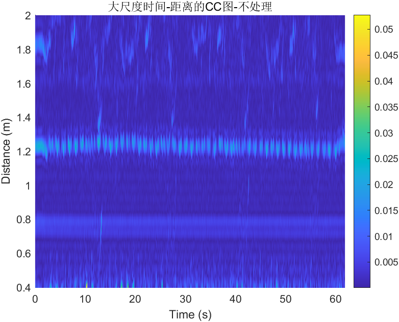

# Acoustic Sensing MATLAB Example

This folder contains the refactored MATLAB example for the 17-23 kHz acoustic echo sensing pipeline.

The main algorithm keeps the original input/output behavior, but the chirp-frame matched filtering step has been optimized:

- old path: repeated time-domain `dot(window, template)` loops;
- new path: one FFT-based sliding template correlation in `matlab/sliding_template_correlation_fft.m`;
- compatibility: `split_chirp_frames.m` keeps the original output arguments used by the main pipeline.

The public example intentionally stops at the large-scale time-distance CC-map stage. Later trajectory extraction and distance-frequency analysis are kept as optional advanced analysis code, rather than being mixed into the default run.




## Run

Open MATLAB in this folder and run:

```matlab
run run_example.m
```

or:

```matlab
run examples/run_sample_pipeline.m
```

The included example input is:

- `data/example/Record.mat`

The included transmit templates are:

- `matlab/templates/chirp_17_23khz_10ms/reference_bottom_channel.mat`
- `matlab/templates/chirp_17_23khz_10ms/reference_top_channel.mat`

## Outputs

The pipeline writes standardized outputs to `data/example/`:

- `correlation_map.txt`
- `distance_axis.txt`
- `time_axis.txt`

For compatibility with the original script, it also writes:

- `CCvalue.txt`
- `Disvalue.txt`
- `Tvalue.txt`

The checked-in example outputs are under `examples/results/current_run/`.

The generated figures are:

- `acoustic_echo_result.png` - processed display used in this README;
- `time_distance_cc_processed.png` - same processed display with a descriptive file name;
- `time_distance_cc_unprocessed.png` - unprocessed display for comparison.

## Optional Advanced Analysis

The optional downstream module is under `matlab/advanced_analysis/`.

It contains the older analysis stages that come after the large-scale CC map:

- large-scale distance-frequency power map;
- local time-distance CC map;
- ridge and local-maximum extraction;
- local distance-frequency power map.

These steps are not called by `run_example.m` by default. They are kept separate so the main GitHub example remains a compact, reproducible CC-map pipeline.

## Fast Correlation Regression

To verify that the FFT sliding correlation matches the old direct dot-product definition on the included data, run:

```matlab
run tests/compare_fft_correlation.m
```

Expected errors are near floating-point roundoff.

## Notes

- `Record.txt` is not included because the text dump is about 105 MB. The compact `Record.mat` file is used by default.
- MATLAB R2022a or newer is recommended.
- Signal Processing Toolbox is required for `firpm`, `filtfilt`, and `hilbert`.
- The optional advanced analysis additionally uses `nufft` and `tfridge`.
