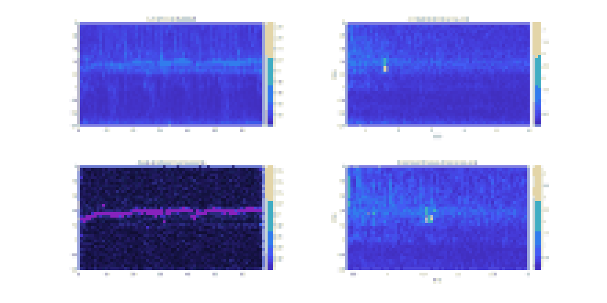

# Acoustic Sensing

MATLAB implementation for acoustic echo sensing with a 17-23 kHz chirp. The main pipeline loads a stereo recording, applies detrending and band-pass filtering, segments chirp frames by normalized cross-correlation, estimates echo distance responses, and exports time-distance correlation results.



## Example Output

The repository includes one processed sample result in `examples/results/sample_run/`. It contains the exported distance axis, time axis, tracking outputs, and the lightweight SVG preview shown above. The raw recording is intentionally excluded because it is large, but the saved outputs can be used to inspect the expected result format.

## Repository Layout

- `matlab/run_acoustic_echo_pipeline.m` - main acoustic sensing pipeline.
- `matlab/split_chirp_frames.m` - chirp frame segmentation by template correlation.
- `matlab/value_to_index.m` - value-to-index helper for time and distance windows.
- `matlab/plot_time_distance_analysis.m` - optional visualization and analysis helper.
- `matlab/utilities/` - utility functions used by the pipeline.
- `matlab/templates/` - small chirp template text files.
- `examples/run_sample_pipeline.m` - example launcher.
- `examples/results/sample_run/` - sample output files from one local test run.
- `data/example/` - local input data location, intentionally ignored by git.

## Requirements

- MATLAB R2022a or newer is recommended.
- Signal Processing Toolbox is required for functions such as `firpm`, `filtfilt`, and `hilbert`.

## Run The Example

The raw input recording is not committed because the original `Record.txt` file is about 105 MB. To run locally:

1. Put `Record.txt` or `Record.mat` in `data/example/`.
2. Open MATLAB at the repository root.
3. Run:

```matlab
run examples/run_sample_pipeline.m
```

The script writes these outputs to the same data directory:

- `correlation_map.txt`
- `distance_axis.txt`
- `time_axis.txt`

The expected recording format is the original interleaved stereo sample vector used by `run_acoustic_echo_pipeline.m`, with the final two values storing start and end timestamps in nanoseconds.

## Notes

- `run_acoustic_echo_pipeline.m` can also be run directly. By default it reads from `data/example/Record.txt`.
- To use another data directory, set `DfilePath`, `DfileName`, and optionally `output_stereo` before running the script.
- No open-source license has been selected yet.
