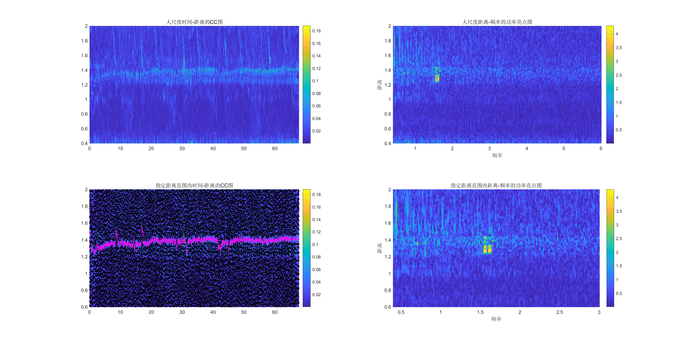

# Acoustic Sensing

MATLAB implementation for acoustic echo sensing with a 17-23 kHz chirp. The main pipeline loads a stereo recording, applies detrending and band-pass filtering, segments chirp frames by normalized cross-correlation, estimates echo distance responses, and exports time-distance correlation results.



## Example Output

The repository includes the current MATLAB script's example recording as `data/example/Record.mat`, the matching transmit-reference templates in `matlab/templates/chirp_17_23khz_10ms/`, and generated outputs in `examples/results/current_run/`. The image shown above is the exported visualization from that run.

The original text recording `Record.txt` is not committed because it is about 105 MB and exceeds GitHub's regular single-file limit. `Record.mat` is the compact MATLAB version used by the example pipeline.

## Repository Layout

- `matlab/run_acoustic_echo_pipeline.m` - main acoustic sensing pipeline.
- `matlab/split_chirp_frames.m` - chirp frame segmentation by template correlation.
- `matlab/value_to_index.m` - value-to-index helper for time and distance windows.
- `matlab/plot_time_distance_analysis.m` - optional visualization and analysis helper.
- `matlab/utilities/` - utility functions used by the pipeline.
- `matlab/templates/` - chirp template MAT files plus text copies.
- `examples/run_sample_pipeline.m` - example launcher.
- `examples/results/current_run/` - current script outputs, including PNG, FIG, MAT, and text files.
- `examples/results/sample_run/` - sample output files from one local test run.
- `data/example/Record.mat` - compact recording used by the included example.

## Requirements

- MATLAB R2022a or newer is recommended.
- Signal Processing Toolbox is required for functions such as `firpm`, `filtfilt`, and `hilbert`.

## Run The Example

The compact MATLAB recording is included in `data/example/Record.mat`. To run locally:

1. Open MATLAB at the repository root.
2. Run:

```matlab
run examples/run_sample_pipeline.m
```

The script reads `data/example/Record.mat` by default. If you only have a text recording, place `Record.txt` in `data/example/`; the script will create `Record.mat` automatically.

The script writes these outputs to the same data directory:

- `correlation_map.txt`
- `distance_axis.txt`
- `time_axis.txt`

The expected recording format is the original interleaved stereo sample vector used by `run_acoustic_echo_pipeline.m`, with the final two values storing start and end timestamps in nanoseconds.

## Notes

- `run_acoustic_echo_pipeline.m` can also be run directly. By default it reads from `data/example/Record.mat`.
- To use another data directory, set `DfilePath`, `DfileName`, and optionally `output_stereo` before running the script.
- No open-source license has been selected yet.
